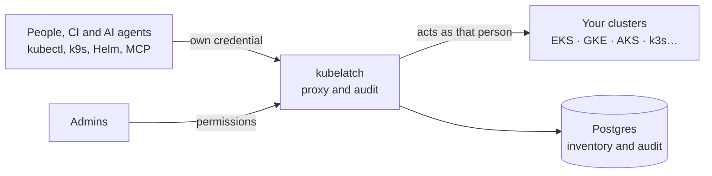

<p align="center"></p>

# kubelatch

kubelatch gives every person, every CI pipeline and every AI agent its own credential for your Kubernetes clusters, with permissions by role: six system roles, and custom roles you compose. It always knows who has access to what and until when, and it records every request to the API server.

Without kubelatch, the usual setup is a shared admin kubeconfig or a hand-made ServiceAccount per person: nobody knows who uses it or when it expires. With kubelatch, every credential has an owner, an expiry date and a usage record, and it can be revoked instantly. It works the same on managed clusters (EKS, GKE, AKS) and self-managed ones (kubeadm, k3s, RKE2, Talos).




**Editions.** kubelatch is free for a small team: 2 clusters, 5 people and 24 hours of audit. Pro lifts those limits with a license key verified offline, priced per person at [kubelatch.com/pricing](https://kubelatch.com/pricing/), with a 30-day trial. See [Editions and license](https://docs.kubelatch.com/operate/editions/). What we commit to:

- What is in Free stays in Free; its limits only ever loosen.
- No telemetry: the key is verified offline and kubelatch calls no service of Picaporte Labs. Air-gapped installations work.
- A limit only stops a new registration. Nothing that exists is cut: access through the proxy, grants, credentials, clusters, people and the custom roles already materialized keep working. If a key was ever installed, audit older than 24 hours is kept, not served, until a key is installed.
- On request, the code can be reviewed under NDA, and we commit to publishing the summary of an external penetration test.

## Install

On Kubernetes, with the Helm chart (the image and the chart are published on GHCR for each release):

```bash
helm --kubeconfig "$MGMT_KUBECONFIG" install kubelatch oci://ghcr.io/picaportelabs/charts/kubelatch \
  --version "$KUBELATCH_VERSION" -n kubelatch -f values.yaml
```

The install guide, the values reference and the rest of the manual are at <https://docs.kubelatch.com> (English) and <https://docs.kubelatch.com/es/> (Spanish). To try it on your machine first: [Try it locally](https://docs.kubelatch.com/getting-started/local/), about 15 minutes with a disposable kind cluster.

The `kubelatch` CLI (browser or device-code sign-in, a kubeconfig with an exec plugin) and `kubelatch-server` are attached to each [release](https://github.com/picaportelabs/kubelatch/releases) for Linux and macOS, amd64 and arm64, with a checksums file.

## Pricing

Free for a small team: 2 clusters, 5 people, 24 hours of audit, the six system roles. Pro lifts the limits for 15 € per person per month, billed yearly, with a 30-day trial without a card: [kubelatch.com/pricing](https://kubelatch.com/pricing/).

## In this repository

| Path | What |
| --- | --- |
| [`examples/github-actions/`](examples/github-actions/) | A GitHub Actions workflow that gets a credential through OIDC, no secret stored |
| [`integrations/`](integrations/) | The Claude Code plugin (`claude plugin marketplace add picaportelabs/kubelatch`), and the same rules for `AGENTS.md`, `CLAUDE.md` and Cursor |
| [`docs/research/`](docs/research/) | The research behind the design (in Spanish): credentials, RBAC and audit in Kubernetes, and the proxy spike |
| [`CHANGELOG.md`](CHANGELOG.md) | Every release |

The source code is not published; it can be reviewed under NDA. See [Security](SECURITY.md).

## Support

Questions and ideas: [Discussions](https://github.com/picaportelabs/kubelatch/discussions). Bugs: [Issues](https://github.com/picaportelabs/kubelatch/issues). Pro customers: `pro@kubelatch.com`.

## Security

Report vulnerabilities to `security@kubelatch.com`, as [SECURITY.md](SECURITY.md) describes. The security model is documented at <https://docs.kubelatch.com/concepts/security/>.

## License

kubelatch is proprietary software under the [End User License Agreement](LICENSE). Pro subscriptions are governed by the [terms](https://kubelatch.com/terms/).
